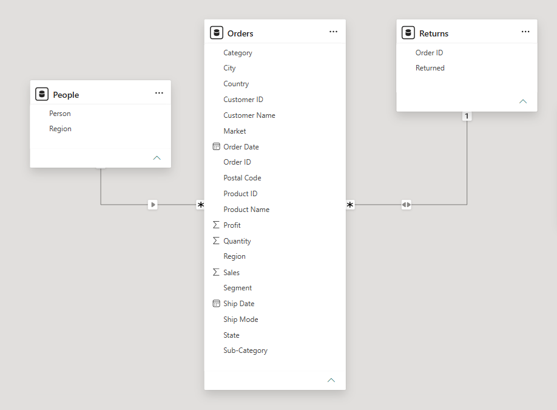
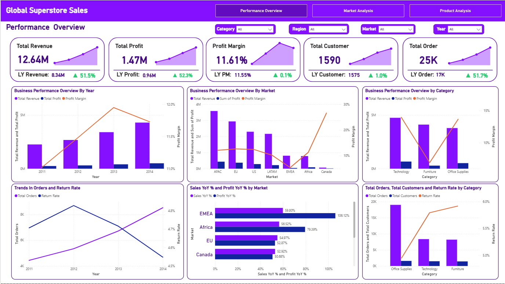
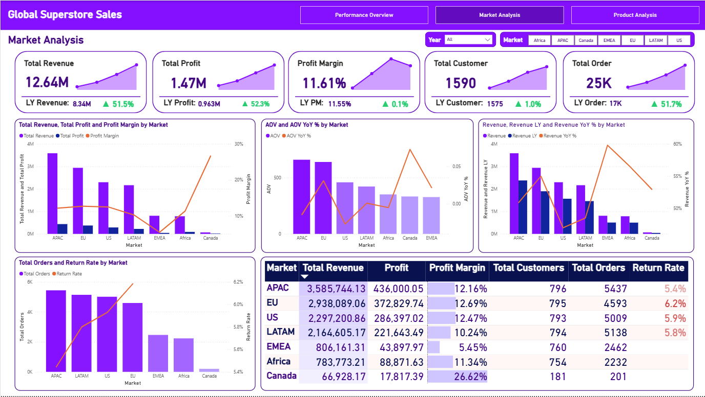
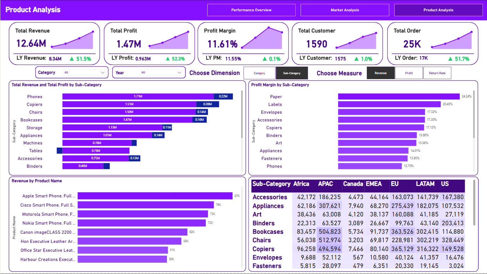

---

  

# 📊 Global Superstore Sales Performance Dashboard | Power BI

_Help a Senior Manager understand the overall business performance, compare markets, and identify which products to grow or cut - all in one interactive dashboard._

- 🎯 **Business Question:** What is the overall business performance, how are different markets doing, and which products should the company focus on?
- 🏬 **Domain:** Global Retail / E-commerce 
- 🛠️ **Tools:** Power BI

👤 Author: Bạch Minh Nam

📅 Date: 2025-12-27

---

## 📑 Table of Contents
1. [📌 Background & Overview](#-background--overview)
2. [📂 Dataset Description & Data Structure](#-dataset-description--data-structure)
3. [🧠 Design Thinking Process](#-design-thinking-process)
4. [📊 Key Insights & Visualizations](#-key-insights--visualizations)
5. [🔎 Final Conclusion & Recommendations](#-final-conclusion--recommendations)

---

## 📌 Background & Overview

### Objective

Global Superstore is a company that sells products in many markets across different continents. The company is growing fast and wants to expand into more markets to gain market share.

The Senior Manager needs a dashboard to answer 3 main questions:

✔️ **Overall performance:** How is the business doing right now? Is revenue and profit growing?

✔️ **Market performance:** Which markets are performing well, and which ones need attention?

✔️ **Product performance:** Which product categories are profitable, and which ones should be prioritized or cut?

This project uses Power BI to turn raw sales data into a dashboard that helps the Senior Manager make faster, data-driven decisions about where to expand and which products to invest in.

### 👤 Who is this project for?

✔️ Senior Managers & Business Directors - to get a quick, reliable view of company performance

✔️ Sales & Market teams - to compare performance across regions and plan strategy

✔️ Product teams - to identify which categories or products drive (or hurt) profit

---

## 📂 Dataset Description & Data Structure

### 📌 Data Source
- Source: Global Superstore Sales dataset (loaded via Power Query)
- Format: Live connection / Power Query

### 📊 Data Structure & Relationships

#### 1️⃣ Tables Used

The dataset has **3 tables**:

- **Orders** - the main table, storing all sales transaction details
- **People** - stores information about the salesperson responsible for each region
- **Returns** - records which orders were returned

#### 2️⃣ Table Schema

**Table: Orders** (main fact table)

| Column Name | Description |
|---|---|
| Order ID | Unique ID for each order |
| Order Date | Date the order was placed |
| Ship Date | Date the order was shipped |
| Ship Mode | Shipping method |
| Customer ID | Unique ID for each customer |
| Customer Name | Name of the customer |
| Segment | Customer segment |
| City | City of the customer |
| State | State/Province of the customer |
| Country | Country of the customer |
| Postal Code | Postal code of the customer's location |
| Market | Market region |
| Region | Sub-region within a market |
| Product ID | Unique ID for each product |
| Category | High-level product category |
| Sub-Category | More specific product grouping under a category |
| Product Name | Name of the product |
| Sales | Total sales value of the order line |
| Quantity | Number of units ordered |
| Discount | Discount rate applied to the order |
| Profit | Profit earned from the order |
| Shipping Cost | Cost to ship the order |
| Order Priority | Priority level of the order  |

**Table: People**

| Column Name | Description |
|---|---|
| Person | Name of the salesperson |
| Region | Region this person is responsible for |

**Table: Returns**

| Column Name | Description |
|---|---|
| Order ID | Order that was returned |
| Returned | Yes/No flag |

#### 3️⃣ Data Relationships

The 3 tables are connected as follows:

- **People → Orders**: One person manages many orders (1-to-many, joined on `Region`)
- **Orders → Returns**: One order can have one return record (joined on `Order ID`)

  

---

## 🧠 Design Thinking Process

This project followed the Design Thinking framework across 3 main steps: Empathize, Define Point of View, and Ideate.

### 1️⃣ Empathize - Understanding the Stakeholder

| Question | Answer |
|---|---|
| **Who views this dashboard?** | Senior Manager |
| **What problem does it solve?** | The Senior Manager needs an easy-to-trust dashboard to quickly understand global business performance, identify strategic markets and products, and make expansion decisions with low risk. |
| **When & where is it used?** | Daily for quick checks, weekly/monthly for strategy reviews, and before board meetings, strategy meetings, or budget planning - viewed on laptop, big screen, or tablet |
| **Why is this analysis needed?** | To make fast, accurate, evidence-based decisions, reduce dependency on manual reports, and lower the risk of expanding into the wrong market |
| **How do they decide?** | They analyze overall KPIs, spot growth/decline trends, and compare performance across markets to prioritize expansion or adjust product strategy |
| **Pains** | Hard to make fast decisions because data is complex, unclear, and not action-oriented |
| **Gains** | Clear insights lead to better decisions and support sustainable growth |
| **Key Questions to Answer** | • How is the business performing right now? • Which markets are growing or declining? • Which products should be prioritized for investment? • What is causing these changes? • What strategic action should come next? |

### 2️⃣ Define Point of View - Choosing the Right Angles

| Point of View | Description | Why the stakeholder cares |
|---|---|---|
| **Overview** | Track Sales & Profit trends over time (Year/Quarter) | To see if the business is growing or declining, and identify peak/low periods |
| **Market** | Compare business performance across Markets/Regions | To see where growth is coming from |
| **Product** | Analyze Sales & Profit by Category/Sub-Category/Product | To find out which categories/products create or destroy profit |

**Northstar Metrics:**

| Northstar 1 | Northstar 2 |
|---|---|
| **Revenue (Revenue Growth Rate)** | **Profit Margin** |
| Formula: `Total Revenue = Σ (AOV × Total Orders) per Market` | Formula: `Global Profit Margin = Total Profit / Total Revenue` |
| Success when: Revenue grows continuously year over year, and growth comes from multiple Markets/Categories (not just one source) | Success when: Profit Margin is maintained or improved while revenue is growing |
| Why this metric: Revenue is the #1 goal - executives need to know "is the company growing?" | Why this metric: Profit ensures the growth is healthy and avoids growing revenue while losing efficiency |

### 3️⃣ Ideate - Structuring the Dashboard

| | **Page 1: Overview** | **Page 2: Market** | **Page 3: Product** |
|---|---|---|---|
| **Layer 0 (Scorecards)** | Total Sales, Total Profit, Sales YoY%, Profit Margin | Sales, Profit, Profit Margin by Market | Profit & Profit Margin by Category, Top Underperforming Products |
| **Layer 1 (1-dimension breakdown)** | Sales & Profit trend by Year, Profit Margin trend by Year, Orders & Return Rate trend | Sales by Market, Return Rate by Market | Top Products by Sales, Profit Margin by Category |
| **Layer 2 (2-dimension breakdown)** | Relationship between Orders ↔ Return Rate | Trend Sales by Market & Year, Total Customers/Orders by Market | Sub-category Profitability Matrix, Sales vs Profit vs Margin by Product |

---

## ⚒️ Main Process

This project goes directly into Power BI visualization (no separate SQL/Python preprocessing step - data is loaded and transformed using Power Query inside Power BI).

1️⃣ **Connect & Load Data** - Connect Power BI to the tables via Power Query

2️⃣ **Data Modeling** - Build relationships between the 3 tables as shown in the Data Relationships section above

3️⃣ **DAX Measures** - Create calculated measures such as Total Sales, Total Profit, Profit Margin, Sales YoY%,...

4️⃣ **Power BI Visualization** - Build dashboard based on the Design Thinking structure above

---

## 📊 Key Insights & Visualizations

### 🔍 Dashboard Preview

#### 1️⃣ Page 1 - Performance Overview

  

📌 **Analysis 1:**

- **Observation:** Overall, the business is growing well - both Revenue and Profit went up more than 50% compared to last year, and Profit Margin stayed stable at around 11.6%. But there's one concern: the Return Rate has been going up every year since 2012, while Total Orders also keep increasing. This means a bigger portion of orders are being returned over time, which could slowly reduce profit if nothing is done. Also, when looking by category, Furniture has decent revenue but a much lower profit margin compared to Technology.

- **Recommendation:**
  - 🔴 **Check the return rate problem first.** Look into which markets or categories have the most returns, and find out why (bad product quality, wrong sizing, slow delivery, etc.).
  - 🟡 **Review Furniture's profit margin.** Compare it with Technology to understand why it's lower - maybe it's discounts, shipping cost, or pricing.
  - 🟢 **Learn from 2013.** That year had the best profit margin, so it's worth checking what was different that year and try to repeat it.

#### 2️⃣ Page 2 - Market Analysis

  

📌 **Analysis 2:**

- **Observation:** APAC and EU bring in the most revenue, which is expected since they're the biggest markets. But Canada - even though it's the smallest market - has the highest profit margin (26.62%). On the other hand, EMEA has the lowest profit margin and the highest return rate (6.2%) among the bigger markets. EMEA's AOV (average order value) also goes up and down a lot from year to year, which shows its performance isn't very stable yet.

- **Recommendation:**
  - 🔴 **Don't expand EMEA yet.** Its low margin and high return rate suggest there are issues to fix first - expanding now would just make those issues bigger.
  - 🟡 **Study what makes Canada so profitable.** Even though it's small, its model (pricing, products sold, etc.) might work well for similar smaller markets like Africa or LATAM.
  - 🟢 **Keep investing in APAC and EU**, since they are the main markets driving the company's revenue and profit.

#### 3️⃣ Page 3 - Product Analysis

  

📌 **Analysis 3:**

- **Observation:** Tables has good revenue (~0.76M), but it actually has a negative profit - meaning the company is losing money on this product. On the other side, Paper and Labels don't show up in the top revenue list, but they have the highest profit margins (24.24% and 20.45%). These products are profitable but not getting much attention. Also, the table shows that APAC and EU make up most of the sales for almost every product category.

- **Recommendation:**
  - 🔴 **Review pricing and cost for Tables.** A product that's losing money needs urgent attention - check if it's because of high discounts, high shipping cost, or low selling price.
  - 🟡 **Promote Paper and Labels more.** These products are very profitable but don't sell as much - giving them more marketing or better placement could help increase overall profit.
  - 🟢 **Try selling high-margin products (like Paper, Labels) in weaker markets** like EMEA or Africa to see if it helps improve their numbers too.

---

## 🔎 Final Conclusion & Recommendations

📍 Key Takeaways:

✔️ **Growth looks good, but watch the return rate.** Revenue and profit are both up over 50%, but the return rate has been rising every year. This should be checked soon before it starts to eat into profit.

✔️ **Focus on markets that work, fix the ones that don't.** Canada is small but very profitable - its approach could help other small markets. EMEA, on the other hand, has low margin and high returns, so it should be improved before expanding further.

✔️ **Pay attention to product profitability, not just sales.** Tables is currently losing money and needs a pricing review. Meanwhile, Paper and Labels are highly profitable but underused - promoting them more could boost overall profit without much extra cost.
